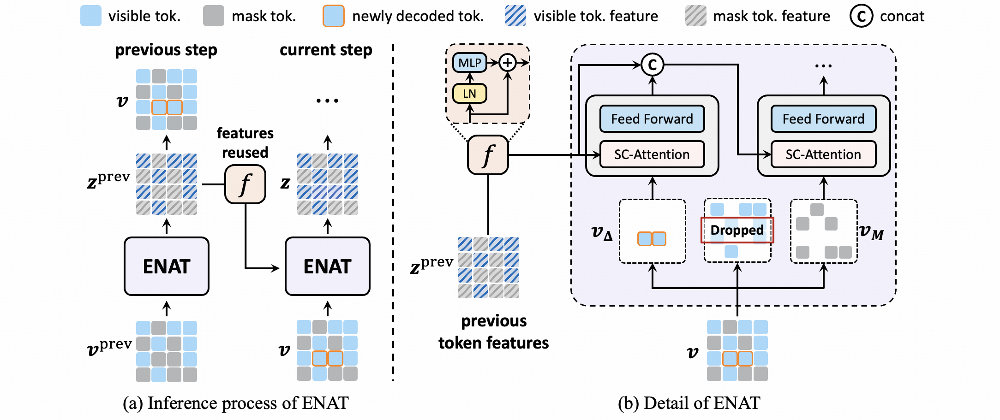

# ENAT (NeurIPS 2024)
This repo contains the official PyTorch implementation of [ENAT: Rethinking Spatial-temporal Interactions in Token-based Image Synthesis](https://arxiv.org/abs/2411.06959).

## Overview

### Background
Recent advancements in token-based generation have proven effective in synthesizing visual content. Non-autoregressive Transformers (NATs), for instance, generate high-quality images in a few steps. NATs progressively reveal latent tokens of the target image step-by-step. At each step, unrevealed regions are masked with `[MASK]` tokens, and NAT predicts them, preserving the most reliable predictions as visible tokens.


### What's New
In this paper, we analyze NATs and uncover two key interaction patterns:

1. **Spatial Interactions**: Although `[MASK]` and visible tokens are uniformly processed, their roles differ:
   - `[MASK]` tokens gather information for decoding.
   - Visible tokens primarily provide information and build their deep representations independently.

2. **Temporal Interactions**: Across steps, computations focus on updating a few critical tokens, while processing most tokens is repetitive.

Driven by these insights, we propose EfficientNAT(**ENAT**), a NAT model that enhances critical interactions and reduces computational cost:

- **Spatial Level**: Disentangle computations by encoding visible tokens independently and decoding `[MASK]` tokens conditioned on fully encoded visible tokens.
- **Temporal Level**: Prioritize critical token updates while reusing previously computed representations for efficiency.

As a result, ENAT is able to improve NAT performance with significantly reduced computational cost.



## Installation
We support PyTorch>=2.0.0 and torchvision>=0.15.1. Please install them following the official instructions.
Clone this repo and install the required packages:
```shell
git clone https://github.com/LeapLabTHU/ENAT.git
cd ENAT
pip install tqdm loguru numpy pandas pyyaml einops omegaconf Pillow accelerate xformers transformers ninja matplotlib scipy opencv-python
```

## Data Preparation

- The ImageNet dataset should be prepared as follows:

```
data
├── train
│   ├── folder 1 (class 1)
│   ├── folder 2 (class 1)
│   ├── ...
```

- Tokenizing the ImageNet dataset:
  Use [this link](https://drive.google.com/file/d/13S_unB87n6KKuuMdyMnyExW0G1kplTbP/view?usp=sharing) to download the pre-trained VQGAN tokenizer and put it in `assets/vqgan_jax_strongaug.ckpt`. Then run the following command to tokenize the ImageNet dataset:

```shell
# for ImageNet-256
python extract_imagenet_feature.py --path data --split train --input_res 256

# for ImageNet-512
python extract_imagenet_feature.py --path data --split train --input_res 512
```
The above commands will save the tokenized ImageNet dataset to `assets/imagenet256_vq_features` and `assets/imagenet512_vq_features`, respectively.

- Prepare FID-stats:
  Download the FID-stats for [ImageNet-256](https://drive.google.com/file/d/1C7DgARuZi9-InTYOgpkE3pggkJB6DMZD/view?usp=drive_link) and [ImageNet-512](https://drive.google.com/file/d/1DJo00khURAV01i-Yqu04KF6bkNBt1J1O/view?usp=drive_link) put them in `assets/fid_stats` directory.

- Prepare pre-trained inception model for FID calculation:
  Download the pre-trained inception model from [this link](https://github.com/mseitzer/pytorch-fid/releases/download/fid_weights/pt_inception-2015-12-05-6726825d.pth) and put it in `assets/pt_inception-2015-12-05-6726825d.pth`.

## Pre-trained Model & Evaluation
### For ImageNet-256:
Download our ENAT-L model from [this link](https://drive.google.com/file/d/1IMT5u5nAp_wWyLyEXaLSYtnEc91UPVol/view?usp=sharing) and put it in `assets/nnet_ema.pth`. Then run the following command for evaluation:

```shell
torchrun --rdzv_backend=c10d --rdzv_endpoint=localhost:0 --nproc_per_node=8 train.py \
    --gen_steps=8 \
    --eval_n 50000 \
    --enc_dec 22 2 \
    --embed_dim 1024 \
    --num_heads 16 \
    --cfg_scale 2.5 \
    --mask_temp 1.5 \
    --samp_temp 6 \
    --pretrained_path assets/nnet_ema.pth \
    --output_dir ./in256_eval \
    --test_bsz 125 \
    --input_res 256 \
    --reference_image_path assets/fid_stats/fid_stats_imagenet256_guided_diffusion.npz
```
### For ImageNet-512:
Download our ENAT-L model from [this link](https://drive.google.com/file/d/1LA4axsWGRso_scFbCUwQ3CigsMvAfWzb/view?usp=sharing) and put it in `assets/nnet_ema_512.pth`. Then run the following command for evaluation:

```shell
torchrun --rdzv_backend=c10d --rdzv_endpoint=localhost:0 --nproc_per_node=8 train.py \
    --gen_steps=8 \
    --eval_n 5000 \
    --enc_dec 22 2 \
    --embed_dim 1024 \
    --num_heads 16 \
    --cfg_scale 3.5 \
    --mask_temp 1.5 \
    --samp_temp 4 \
    --pretrained_path assets/nnet_ema_512.pth \
    --output_dir ./in512_eval \
    --test_bsz 25 \
    --input_res 512 \
    --reference_image_path assets/fid_stats/fid_stats_imagenet512_guided_diffusion.npz
```

## Training Scripts
We have trained our ENAT-L model on ImageNet-256 and ImageNet-512 with 16 A100 GPUs. 

To train the ENAT-L model on ImageNet-256, run the following command:
```shell
torchrun --nproc_per_node=8 --nnodes=2 --node_rank=... --master_addr=... --master_port=... train.py \
    --gen_steps=8 \
    --enc_dec 22 2 \
    --embed_dim 1024 \
    --num_heads 16 \
    --output_dir ./in256_train \
    --train_steps 500000 \
    --input_res 256 \
    --batch_size 2048 \
    --lr 0.0004
```
To train the ENAT-L model on ImageNet-512, run the following command:
```shell
torchrun --nproc_per_node=8 --nnodes=2 --node_rank=... --master_addr=... --master_port=... train.py \
    --gen_steps=8 \
    --enc_dec 22 2 \
    --embed_dim 1024 \
    --num_heads 16 \
    --output_dir ./in512_train \
    --train_steps 500000 \
    --input_res 512 \
    --batch_size 512 \
    --lr 0.0001
```


## Citation

If you find our work useful for your research, please consider citing

```
@inproceedings{Ni2024ENAT,
  title={Enat: Rethinking spatial-temporal interactions in token-based image synthesis},
  author={Ni, Zanlin and Wang, Yulin and Zhou, Renping and Han, Yizeng and Guo, Jiayi and Liu, Zhiyuan and Yao, Yuan and Huang, Gao},
  booktitle={NeurIPS},
  year={2024}
}
```

## Acknowledgements

Our implementation is based on
- [U-ViT](https://github.com/baofff/U-ViT) (Training code)
- [DiT](https://github.com/facebookresearch/DiT) (Network architecture)
- [MaskGIT](https://github.com/google-research/maskgit) (NAT sampling code)
- [MAGE](https://github.com/LTH14/mage?tab=readme-ov-file) (VQGAN weights)
- [VQGAN](https://github.com/CompVis/taming-transformers) (VQGAN code)
- [pytorch-fid](https://github.com/mseitzer/pytorch-fid) (official implementation of FID and IS in PyTorch)

We thank the authors for their excellent work.

## Contact

If you have any questions, feel free to send mail to [nzl22@mails.tsinghua.edu.cn](mailto:nzl22@mails.tsinghua.edu.cn).